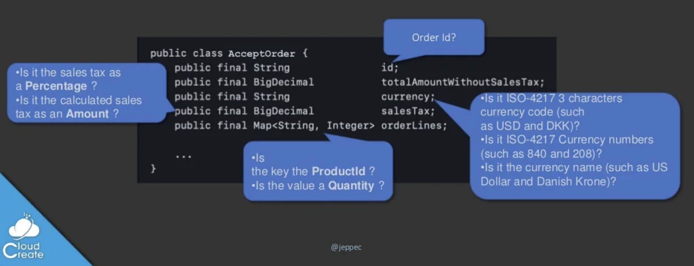

# Essentials Java building blocks

Essentials is a set of Java version 11 (and later) building blocks built from the ground up to have no dependencies
on other libraries, unless explicitly mentioned.

The Essentials philosophy is to provide high level building blocks and coding constructs that allows for concise and
strongly typed code, which doesn't depend on other libraries or frameworks, but instead allows easy integrations with
many of the most popular libraries and frameworks such as Jackson, Spring Boot, Spring Data, JPA, etc.

## Types

This library focuses purely on providing base semantic types and utility types that can be used to better documented and more
strongly typed code.

To use `Types` just add the following Maven dependency:

```
<dependency>
    <groupId>dk.cloudcreate.essentials</groupId>
    <artifactId>types</artifactId>
    <version>0.8.1</version>
</dependency>
```

`Types` usually needs additional third party dependencies to work, such as:
```
<dependency>
    <groupId>org.slf4j</groupId>
    <artifactId>slf4j-api</artifactId>
</dependency>
```

**NOTE:**
**This library is WORK-IN-PROGRESS**

### Single Value Types

It is not uncommon to see Java code like this:

```
public class CreateOrder {
    public final String               id;
    public final BigDecimal           totalAmountWithoutSalesTax;
    public final String               currency;
    public final BigDecimal           salesTax;
    public final Map<String, Integer> orderLines;

    ...
}
```



This code might at the surface look okay, but returning to it after a few weeks is likely to introduce questions like:

- What is the `id` - is it the id of the Order?
    - Most likely, but we cannot be sure unless we look at how this property is processed in the code dealing
      with `CreateOrder`
- What format does the `currency` property have?
    - Is it ISO-4217 3 characters currency code (such as `USD` and `DKK`)?
    - Is it ISO-4217 Currency numbers (such as `840` and `208`)?
    - Is it the currency name (such as `US Dollar` and `Danish Krone`)?
- What is the `salesTax`?
    - Is it the sales tax as a `Percentage` ?
    - Is it the calculated sales tax as an `Amount` ?
- What does the `orderLines` property contain?
    - Is the `key` the `ProductId` ?
    - Is the `value` a `Quantity` ?

### Creating your own custom type

A `SingleValueType` encapsulates a **single** NON-NULL _value_ of a given supported **Value type**:

| `SingleValueType` specialization | Value Type              | 
|----------------------------------|-------------------------|
| `BigDecimalType`                 | `BigDecimal`            |
| `BigIntegerType`                 | `BigInteger`            |
| `ByteType`                       | `Byte`                  |
| `CharSequenceType`               | `CharSequence`/`String` |
| `DoubleType`                     | `Double`                |
| `FloatType`                      | `Float`                 |
| `IntegerType`                    | `Integer`               |
| `LongType`                       | `Long`                  |
| `ShortType`                      | `Short`                 |
| `InstantType`                    | `Instant`               |
| `LocalDateTimeType`              | `LocalDateTime`         |
| `LocalDateType`                  | `LocalDate`             |
| `LocalTimeType`                  | `LocalTime`             |
| `OffsetDateTimeType`             | `OffsetDateTime`        |
| `ZonedDateTimeType`              | `ZonedDateTime`         |

With the `SingleValueType` and supporting classes we can define this alternative `CreateOrder` class definition, which
clearly indicates the roles and types of information:

```
public class CreateOrder {
    public final OrderId                  id;
    public final Amount                   totalAmountWithoutSalesTax;
    public final Currency                 currency;
    public final Percentage               salesTax;
    public final Map<ProductId, Quantity> orderLines;

    private CurrencyCode currency;
    private CountryCode  country;
    private EmailAddress email;
    ...
}
```

The advantage of using Semantic `Types` is that they are fully functional and can be used for calculations:

```
Amount totalAmountWithoutSalesTax = Amount.of("100.00");
Percentage salesTaxPct = Percentage.from("25");
Amount salesTaxAmount = salesTaxPct.of(totalAmountWithoutSalesTax);
Amount totalSales = totalAmountWithoutSalesTax.add(salesTaxAmount); // 125.00
```

`OrderId` is a custom String based `SingleValueType` that extends the provided `CharSequenceType`:

```
public class OrderId extends CharSequenceType<OrderId> implements Identifier {
    public OrderId(CharSequence value) {
        super(value);
    }
}
```

Depending on your taste, then this is all you need to do to create your own custom semantic type. We typically like to add
additional convenience methods:

- `of` - to create an instance using a static method: `OrderId id = OrderId.of("abc789");`
- `ofNullable` - to convert a potential `null` String value: `OrderId id = OrderId.of(someParameterThatMaybeNull);`
- `random` - which creates a new `id` with a random value (e.g. using a `UUID` to generate the random value)

```
public class OrderId extends CharSequenceType<OrderId> implements Identifier {
    public OrderId(CharSequence value) {
        super(value);
    }

    public static OrderId of(CharSequence value) {
        return new OrderId(value);
    }

    public static OrderId ofNullable(CharSequence value) {
        return value != null ? new CustomerId(value) : null;
    }

    public static OrderId random() {
        return new CustomerId(UUID.randomUUID().toString());
    }
}
```

`SingleValueType` also has a static `from` method, which can be used to create a new identifier instance from e.g.
deserializers or generic code:

`OrderId id = SingleValueType.from("abc789", OrderId.class);`

### Built in top level types

Here's a list of the currently supported top level types:

- `Amount` - which is a specialization of `BigDecimalType` that can be used to encapsulate (money) amounts.
- `Percentage` - which is a specialization of `BigDecimalType` that can be used to encapsulate percentages and which can
  be used percentage calculations
- ISO-3166 2 character `CountryCode`'s
- ISO-4217 3 character `CurrencyCode`
- `EmailAddress` which is an immutable Email address value type that supports configurable validation
- `Money` type that combines `Amount` and `CurrencyCode`

## Framework support

Currently, we support for serialization/deserialization/persistence of `Types` through the following Essentials
libraries:

- **Jackson** JSON: using the `types-jackson` library
- **Spring Data Mongo**: using the `types-springdata-mongo` library
- **Spring Data JPA**: using the  `types-springdata-jpa` library
- **Jdbi v3**: using the `types-jdbi` library
- **Avro**: using the `types-avro` library